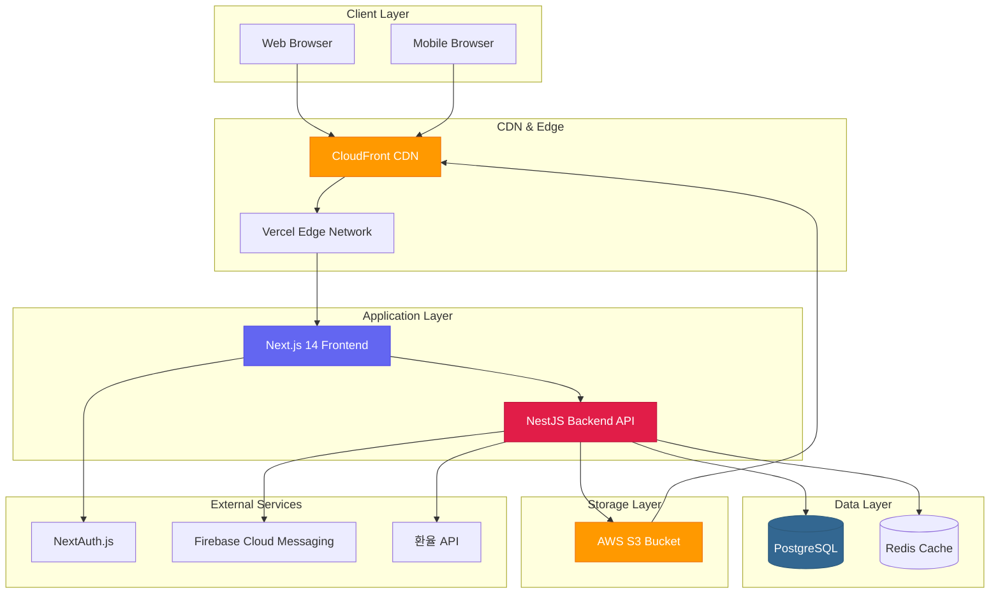
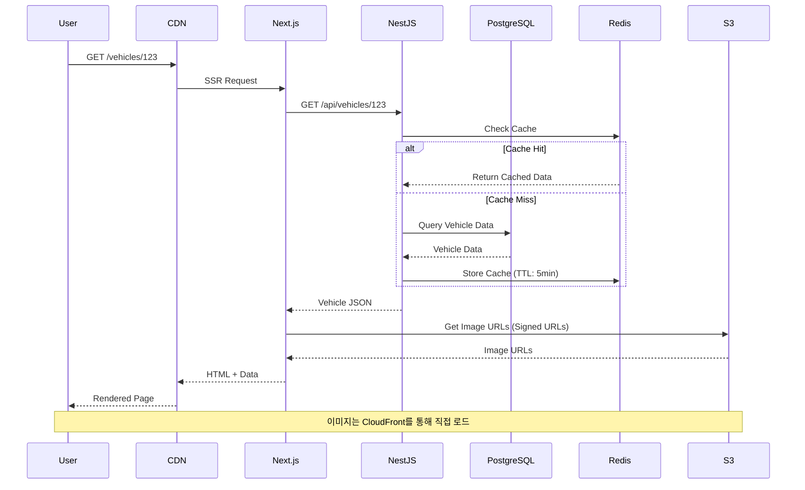
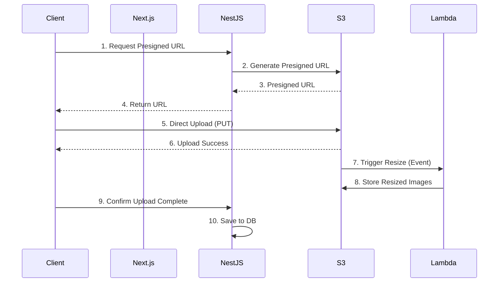
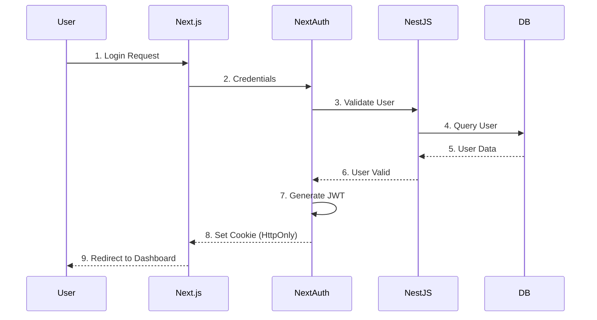
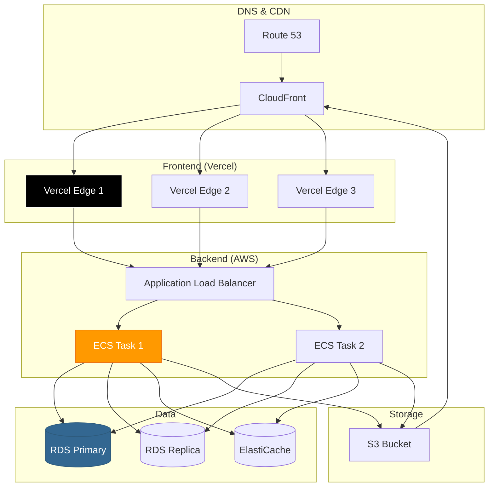

# Hyper-Connect MVP 시스템 아키텍처 설계서

**프로젝트명**: Hyper-Connect (MVP)
**작성일**: 2026-01-18
**버전**: 1.0
**승인 상태**: CEO 승인 완료

---

## 1. 개요

### 1.1 목적
Hyper-Connect는 고급 차량(슈퍼카/하이퍼카) 거래 플랫폼으로, 다음을 달성하기 위한 시스템을 설계합니다:
- 글로벌 바이어와 국내 판매자 직접 연결
- 고용량 미디어(4K 영상, 고해상도 이미지) 처리
- 신뢰 기반 검증 시스템
- 다국어/다통화 지원

### 1.2 설계 원칙
1. **확장 가능성**: 사용자 증가에 대비한 수평 확장
2. **성능**: 3초 이내 페이지 로딩, 200ms 이내 API 응답
3. **보안**: 고액 거래 특성상 강력한 보안 체계
4. **사용자 경험**: 럭셔리 브랜드에 어울리는 매끄러운 UX

---

## 2. 전체 시스템 구조

### 2.1 High-Level Architecture



### 2.2 Request Flow (차량 상세 페이지 예시)



---

## 3. 기술 스택 (승인된 스택)

### 3.1 Frontend

| 기술 | 버전 | 역할 |
|------|------|------|
| **Next.js** | 14.x (App Router) | React 프레임워크, SSR/SSG |
| **TypeScript** | 5.x | 타입 안정성 |
| **Tailwind CSS** | 3.x | 유틸리티 CSS |
| **Shadcn/ui** | Latest | 고품질 UI 컴포넌트 |
| **React Hook Form** | 7.x | 폼 관리 |
| **Zod** | 3.x | 스키마 검증 |
| **NextAuth.js** | 5.x | 인증 처리 |
| **TanStack Query** | 5.x | 서버 상태 관리 |

**선정 이유**:
- Next.js 14 App Router: 최신 SSR/RSC 지원, SEO 최적화
- Tailwind + Shadcn/ui: 빠른 개발, 일관된 디자인 시스템
- React Hook Form + Zod: F1 등록 폼의 복잡한 검증 로직 처리

---

### 3.2 Backend

| 기술 | 버전 | 역할 |
|------|------|------|
| **NestJS** | 10.x | Node.js 백엔드 프레임워크 |
| **Prisma** | 5.x | ORM, 타입 안전 DB 쿼리 |
| **PostgreSQL** | 15.x | 관계형 데이터베이스 |
| **Redis** | 7.x | 캐싱, 세션 저장소 |
| **Passport.js** | Latest | 인증 미들웨어 |
| **class-validator** | Latest | DTO 검증 |
| **AWS SDK** | 3.x | S3 연동 |

**선정 이유**:
- NestJS: 엔터프라이즈급 구조, TypeScript 네이티브, 모듈화
- Prisma: 타입 안전, 자동 마이그레이션, 우수한 DX
- PostgreSQL: JSON 타입 지원(옵션 데이터), 트랜잭션 안정성

---

### 3.3 Infrastructure & DevOps

| 서비스 | 역할 | 비고 |
|--------|------|------|
| **Vercel** | Frontend 호스팅 | Next.js 최적화, 자동 배포 |
| **AWS EC2/ECS** | Backend 호스팅 | 초기: t3.medium 1대 |
| **AWS RDS** | PostgreSQL 관리형 | Multi-AZ, 자동 백업 |
| **AWS ElastiCache** | Redis 관리형 | 캐시 전용 |
| **AWS S3** | 오브젝트 스토리지 | 이미지/영상 저장 |
| **CloudFront** | CDN | S3 콘텐츠 전송 가속화 |
| **GitHub Actions** | CI/CD | 자동 테스트 및 배포 |
| **Docker** | 컨테이너화 | 개발/프로덕션 환경 일치 |

**비용 최적화 전략** (MVP):
- RDS: db.t3.micro (프리티어 활용)
- ElastiCache: cache.t3.micro
- S3: Intelligent-Tiering (자동 비용 최적화)
- CloudFront: 한국/미국/중동 주요 엣지만 활성화

---

## 4. 계층별 상세 설계

### 4.1 Presentation Layer (Frontend)

**디렉토리 구조** (Next.js 14 App Router):
```
src/
├── app/                      # Next.js App Router
│   ├── (auth)/              # 인증 관련 페이지
│   │   ├── login/
│   │   └── register/
│   ├── (main)/              # 메인 레이아웃
│   │   ├── page.tsx         # 홈 (/)
│   │   ├── vehicles/        # 차량 목록/상세
│   │   │   ├── page.tsx     # 목록 (/vehicles)
│   │   │   ├── [id]/        # 상세 (/vehicles/123)
│   │   │   └── new/         # 등록 (/vehicles/new)
│   │   └── dashboard/       # 판매자 대시보드
│   └── api/                 # API Routes (NextAuth, webhooks)
├── components/              # React 컴포넌트
│   ├── ui/                  # Shadcn/ui 기본 컴포넌트
│   ├── forms/               # F1 등록 폼 컴포넌트
│   ├── vehicle/             # 차량 관련 컴포넌트
│   └── layout/              # 레이아웃 컴포넌트
├── lib/                     # 유틸리티, API 클라이언트
├── hooks/                   # Custom React Hooks
└── types/                   # TypeScript 타입 정의
```

**주요 기능**:
- **SSR (Server-Side Rendering)**: 차량 상세 페이지 (SEO)
- **CSR (Client-Side Rendering)**: 대시보드, 폼 입력
- **ISR (Incremental Static Regeneration)**: 차량 목록 (5분 재생성)

---

### 4.2 Application Layer (Backend)

**디렉토리 구조** (NestJS):
```
src/
├── modules/
│   ├── auth/                # 인증/인가
│   │   ├── auth.controller.ts
│   │   ├── auth.service.ts
│   │   ├── guards/          # JWT, Role Guards
│   │   └── strategies/      # Passport Strategies
│   ├── users/               # 사용자 관리
│   ├── vehicles/            # 차량 CRUD (F1 핵심)
│   │   ├── dto/             # Data Transfer Objects
│   │   ├── entities/        # Prisma 엔티티
│   │   └── vehicles.service.ts
│   ├── media/               # 미디어 업로드
│   │   └── s3.service.ts    # S3 업로드 로직
│   ├── maintenance/         # 정비 이력
│   ├── options/             # 차량 옵션 마스터 데이터
│   └── admin/               # 관리자 기능
├── common/                  # 공통 모듈
│   ├── decorators/
│   ├── filters/             # 예외 필터
│   ├── interceptors/        # 로깅, 캐싱 인터셉터
│   └── pipes/               # 검증 파이프
├── prisma/
│   └── schema.prisma        # DB 스키마 정의
└── main.ts
```

**레이어 분리**:
```
Controller → Service → Repository(Prisma) → Database
```

**트랜잭션 처리 예시** (F1 차량 등록):
```typescript
// vehicles.service.ts
async createVehicle(dto: CreateVehicleDto, userId: string) {
  return this.prisma.$transaction(async (tx) => {
    // 1. 차량 기본 정보 생성
    const vehicle = await tx.vehicle.create({...});

    // 2. 옵션 연결 (다대다 관계)
    await tx.vehicleOption.createMany({...});

    // 3. 소모품 상태 생성
    await tx.consumableStatus.create({...});

    return vehicle;
  });
}
```

---

### 4.3 Data Layer

**PostgreSQL 스키마 개요** (상세는 별도 문서):
```
users
vehicles ──< vehicle_options >── options
vehicles ──< maintenance_records
vehicles ──< consumable_status
vehicles ──< media_files
vehicles ──< inspection_reports (P1)
```

**Redis 캐싱 전략**:
| 키 패턴 | 데이터 | TTL |
|---------|--------|-----|
| `vehicle:{id}` | 차량 상세 | 5분 |
| `vehicles:list:{page}` | 차량 목록 | 1분 |
| `options:{brand}` | 브랜드별 옵션 | 1시간 |
| `session:{userId}` | 세션 데이터 | 24시간 |

**캐시 무효화**:
- 차량 정보 수정 시: `vehicle:{id}` 삭제
- 새 차량 등록 시: `vehicles:list:*` 전체 삭제

---

### 4.4 Storage Layer (미디어 처리)

**S3 버킷 구조**:
```
hyper-connect-media/
├── vehicles/
│   ├── {vehicleId}/
│   │   ├── images/
│   │   │   ├── original/    # 원본 이미지
│   │   │   ├── large/       # 1920x1080
│   │   │   ├── medium/      # 1024x768
│   │   │   └── thumb/       # 320x240
│   │   ├── videos/
│   │   │   ├── raw/         # 원본 4K (P1)
│   │   │   └── hls/         # HLS 스트림 (P1)
│   │   └── documents/       # 정비 이력 PDF
└── temp/                    # 임시 업로드 (24시간 자동 삭제)
```

**업로드 플로우**:


**이미지 최적화** (Lambda@Edge 또는 EC2 워커):
- Sharp 라이브러리 사용
- WebP 포맷 자동 변환
- 메타데이터 제거 (EXIF)

---

## 5. 보안 아키텍처

### 5.1 인증 & 인가

**인증 플로우** (NextAuth.js):


**JWT 토큰 구조**:
```json
{
  "sub": "user-uuid",
  "email": "user@example.com",
  "role": "seller",
  "iat": 1705564800,
  "exp": 1705651200
}
```

**권한 체계**:
| Role | 권한 |
|------|------|
| `buyer` | 차량 조회, 오퍼 제출 (P2) |
| `seller` | 차량 등록, 대시보드 |
| `admin` | 모든 권한, 승인 처리 |

---

### 5.2 데이터 보안

**민감 정보 암호화**:
- 비밀번호: bcrypt (salt rounds: 12)
- VIN: AES-256 암호화 (AWS KMS)
- 차량등록번호: 부분 마스킹 (123가4567 → 123가****)

**API 보안**:
- HTTPS 강제 (TLS 1.3)
- CORS 제한: 도메인 화이트리스트
- Rate Limiting: 100 req/min per IP
- SQL Injection 방지: Prisma Parameterized Queries
- XSS 방지: 입력 값 sanitize, CSP 헤더

**S3 보안**:
- 버킷 퍼블릭 액세스 차단
- Presigned URL (유효기간: 15분)
- CloudFront Signed URLs (프리미엄 콘텐츠)

---

## 6. 성능 최적화 전략

### 6.1 Frontend 최적화

| 기법 | 적용 |
|------|------|
| **Code Splitting** | Next.js 자동 분할, Dynamic Import |
| **Image Optimization** | Next.js Image 컴포넌트 (자동 WebP) |
| **Lazy Loading** | 차량 목록 무한 스크롤 |
| **Prefetching** | 상세 페이지 링크 hover 시 |
| **CDN Caching** | Static Assets (max-age: 1년) |

---

### 6.2 Backend 최적화

| 기법 | 적용 |
|------|------|
| **Database Indexing** | `vehicles.id`, `vehicles.created_at` |
| **Query Optimization** | Prisma `include` 최소화, N+1 방지 |
| **Redis Caching** | 자주 조회되는 데이터 캐싱 |
| **Connection Pooling** | Prisma Pool Size: 10 |
| **API Response Compression** | gzip (threshold: 1KB) |

---

### 6.3 미디어 성능

**4K 영상 스트리밍** (P1):
- HLS (HTTP Live Streaming) 사용
- Adaptive Bitrate: 4K, 1080p, 720p, 480p
- CloudFront 엣지 캐싱

**이미지 로딩**:
- Progressive JPEG (점진적 로딩)
- Srcset 반응형 이미지
- Lazy Loading (viewport 기준)

---

## 7. 모니터링 & 로깅

### 7.1 모니터링 도구

| 도구 | 역할 |
|------|------|
| **Vercel Analytics** | Frontend 성능 모니터링 |
| **Sentry** | 에러 트래킹 (Frontend + Backend) |
| **AWS CloudWatch** | 인프라 모니터링 |
| **Prisma Studio** | DB 데이터 확인 (개발) |

### 7.2 로깅 전략

**로그 레벨**:
- `ERROR`: 시스템 오류, 즉시 대응 필요
- `WARN`: 비정상이지만 복구 가능
- `INFO`: 주요 이벤트 (차량 등록, 승인)
- `DEBUG`: 개발 환경 상세 로그

**로그 포맷** (JSON):
```json
{
  "timestamp": "2026-01-18T12:34:56.789Z",
  "level": "INFO",
  "context": "VehiclesService",
  "message": "Vehicle created",
  "vehicleId": "uuid",
  "userId": "uuid"
}
```

---

## 8. 배포 아키텍처

### 8.1 Production 환경



### 8.2 CI/CD 파이프라인

**GitHub Actions Workflow**:
```yaml
# .github/workflows/deploy.yml
name: Deploy

on:
  push:
    branches: [main]

jobs:
  frontend:
    runs-on: ubuntu-latest
    steps:
      - Checkout
      - Install Dependencies
      - Run Tests
      - Build
      - Deploy to Vercel

  backend:
    runs-on: ubuntu-latest
    steps:
      - Checkout
      - Run Tests
      - Build Docker Image
      - Push to ECR
      - Deploy to ECS
```

---

## 9. 확장 계획

### 9.1 수평 확장 (Horizontal Scaling)

| 레이어 | 확장 방법 |
|--------|----------|
| **Frontend** | Vercel 자동 스케일링 |
| **Backend** | ECS Auto Scaling (CPU 70% 기준) |
| **Database** | Read Replica 추가 (조회 부하 분산) |
| **Cache** | ElastiCache Cluster Mode |

### 9.2 Phase 2 추가 기능 대비

**실시간 기능** (P2):
- WebSocket 서버 추가 (Socket.io)
- Redis Pub/Sub (오퍼 알림)

**글로벌 확장**:
- Multi-Region 배포 (아시아, 유럽, 북미)
- i18n 리소스 CDN 캐싱

---

## 10. 비용 추정 (월 기준, MVP)

| 서비스 | 스펙 | 월 비용 (USD) |
|--------|------|--------------|
| Vercel Pro | Frontend | $20 |
| AWS EC2 (t3.medium) | Backend x1 | $30 |
| AWS RDS (db.t3.micro) | PostgreSQL | $15 |
| AWS ElastiCache (cache.t3.micro) | Redis | $12 |
| AWS S3 | 50GB 저장 | $1 |
| CloudFront | 100GB 전송 | $8 |
| Sentry | 에러 트래킹 | $26 (Team) |
| **합계** | | **~$112/월** |

**확장 시 예상** (사용자 10배 증가):
- EC2: t3.medium x3 → $90
- RDS: db.t3.small + Replica → $60
- S3/CloudFront: 500GB → $50
- **합계**: ~$350/월

---

## 11. 위험 요소 및 대응

| 위험 | 영향 | 완화 전략 |
|------|------|----------|
| S3 비용 폭증 | 높음 | Intelligent-Tiering, Lifecycle Policy |
| DB 병목 | 중간 | Read Replica, Redis 캐싱 |
| API 과부하 | 중간 | Rate Limiting, ECS Auto Scaling |
| 보안 침해 | 높음 | 정기 보안 감사, 침투 테스트 |

---

## 12. 다음 단계

이 아키텍처 설계를 기반으로 다음 문서를 작성합니다:
1. ✅ **데이터베이스 스키마 설계서** (다음 작업)
2. API 명세서
3. 페이지 구조 설계서

---

## 변경 이력

| 버전 | 날짜 | 변경 내용 | 작성자 |
|------|------|----------|--------|
| 1.0 | 2026-01-18 | 초안 작성 (CEO 승인된 기술 스택 반영) | Claude |
