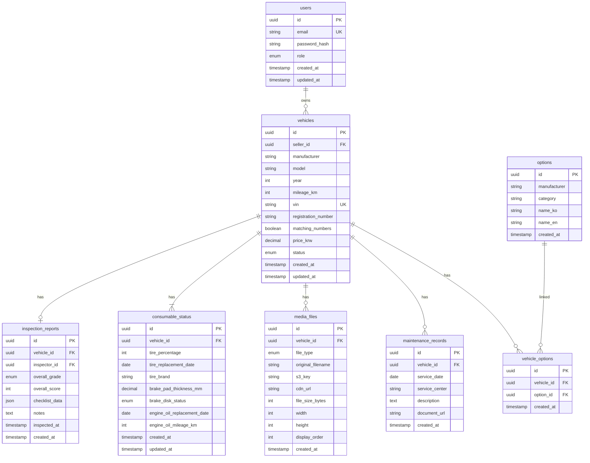

# Hyper-Connect MVP 데이터베이스 스키마 설계서

**프로젝트명**: Hyper-Connect (MVP)
**작성일**: 2026-01-18
**버전**: 1.0
**DB**: PostgreSQL 15.x
**ORM**: Prisma 5.x

---

## 1. 개요

### 1.1 목적
F1. 하이엔드 자산 등록 기능을 중심으로 필요한 데이터 모델을 설계합니다.

### 1.2 설계 원칙
1. **정규화**: 3NF까지 정규화하되, 성능을 위한 비정규화는 선택적 적용
2. **타입 안전성**: Prisma를 통한 타입 안전 쿼리
3. **확장 가능성**: 향후 기능 추가를 고려한 유연한 스키마
4. **감사 추적**: `created_at`, `updated_at` 모든 테이블에 포함

---

## 2. ERD (Entity Relationship Diagram)



---

## 3. 테이블 상세 정의

### 3.1 users (사용자)

**목적**: 판매자, 구매자, 관리자 계정 관리

| 필드명 | 타입 | 제약조건 | 설명 |
|--------|------|----------|------|
| `id` | UUID | PK, DEFAULT gen_random_uuid() | 사용자 고유 ID |
| `email` | VARCHAR(255) | UNIQUE, NOT NULL | 이메일 (로그인 ID) |
| `password_hash` | VARCHAR(255) | NOT NULL | bcrypt 해시 (salt rounds: 12) |
| `name` | VARCHAR(100) | NOT NULL | 사용자 이름 |
| `phone` | VARCHAR(20) | NULL | 전화번호 (선택) |
| `role` | ENUM | NOT NULL, DEFAULT 'buyer' | 역할: buyer, seller, admin |
| `email_verified` | BOOLEAN | DEFAULT false | 이메일 인증 여부 |
| `created_at` | TIMESTAMP | DEFAULT NOW() | 생성 일시 |
| `updated_at` | TIMESTAMP | DEFAULT NOW() | 수정 일시 |

**인덱스**:
- `users_email_idx`: `email` (UNIQUE)
- `users_role_idx`: `role` (조회 성능)

**Prisma 스키마**:
```prisma
model User {
  id             String    @id @default(uuid())
  email          String    @unique
  passwordHash   String    @map("password_hash")
  name           String
  phone          String?
  role           UserRole  @default(BUYER)
  emailVerified  Boolean   @default(false) @map("email_verified")
  createdAt      DateTime  @default(now()) @map("created_at")
  updatedAt      DateTime  @updatedAt @map("updated_at")

  vehicles       Vehicle[]  @relation("SellerVehicles")

  @@index([email])
  @@index([role])
  @@map("users")
}

enum UserRole {
  BUYER
  SELLER
  ADMIN
}
```

---

### 3.2 vehicles (차량 기본 정보)

**목적**: F1 기능의 핵심 - 차량 등록 정보 저장

| 필드명 | 타입 | 제약조건 | 설명 |
|--------|------|----------|------|
| `id` | UUID | PK | 차량 고유 ID |
| `seller_id` | UUID | FK → users.id, NOT NULL | 판매자 ID |
| `manufacturer` | VARCHAR(100) | NOT NULL | 제조사 (Ferrari, Porsche 등) |
| `model` | VARCHAR(100) | NOT NULL | 모델명 (488 Pista, 911 GT3 RS) |
| `year` | INT | NOT NULL, CHECK (year >= 1950) | 연식 |
| `mileage_km` | INT | NOT NULL, CHECK (mileage_km >= 0) | 주행거리 (km) |
| `vin` | VARCHAR(17) | UNIQUE, NOT NULL | VIN (차대번호, 17자리) |
| `registration_number` | VARCHAR(20) | NULL | 차량등록번호 (선택, 마스킹) |
| `matching_numbers` | BOOLEAN | DEFAULT false | 매칭넘버 여부 |
| `price_krw` | DECIMAL(15,0) | NOT NULL, CHECK (price_krw > 0) | 희망 판매가 (KRW) |
| `description_ko` | TEXT | NULL | 차량 설명 (한국어) |
| `description_en` | TEXT | NULL | 차량 설명 (영어) |
| `status` | ENUM | NOT NULL, DEFAULT 'draft' | 상태 (draft, pending, approved, sold) |
| `view_count` | INT | DEFAULT 0 | 조회수 |
| `approved_at` | TIMESTAMP | NULL | 관리자 승인 일시 |
| `approved_by` | UUID | FK → users.id, NULL | 승인한 관리자 ID |
| `created_at` | TIMESTAMP | DEFAULT NOW() | 등록 일시 |
| `updated_at` | TIMESTAMP | DEFAULT NOW() | 수정 일시 |

**상태 값 (status)**:
- `draft`: 임시 저장
- `pending`: 제출 완료, 승인 대기
- `approved`: 승인됨, 공개
- `rejected`: 거절됨
- `sold`: 판매 완료

**인덱스**:
- `vehicles_vin_idx`: `vin` (UNIQUE)
- `vehicles_seller_id_idx`: `seller_id` (판매자별 조회)
- `vehicles_status_idx`: `status` (상태별 필터링)
- `vehicles_created_at_idx`: `created_at DESC` (최신순 정렬)
- `vehicles_manufacturer_model_idx`: `manufacturer, model` (검색)

**Prisma 스키마**:
```prisma
model Vehicle {
  id                 String         @id @default(uuid())
  sellerId           String         @map("seller_id")
  manufacturer       String
  model              String
  year               Int
  mileageKm          Int            @map("mileage_km")
  vin                String         @unique
  registrationNumber String?        @map("registration_number")
  matchingNumbers    Boolean        @default(false) @map("matching_numbers")
  priceKrw           Decimal        @map("price_krw")
  descriptionKo      String?        @map("description_ko")
  descriptionEn      String?        @map("description_en")
  status             VehicleStatus  @default(DRAFT)
  viewCount          Int            @default(0) @map("view_count")
  approvedAt         DateTime?      @map("approved_at")
  approvedBy         String?        @map("approved_by")
  createdAt          DateTime       @default(now()) @map("created_at")
  updatedAt          DateTime       @updatedAt @map("updated_at")

  seller             User           @relation("SellerVehicles", fields: [sellerId], references: [id])
  options            VehicleOption[]
  maintenanceRecords MaintenanceRecord[]
  consumableStatus   ConsumableStatus?
  mediaFiles         MediaFile[]
  inspectionReport   InspectionReport?

  @@index([sellerId])
  @@index([status])
  @@index([createdAt])
  @@index([manufacturer, model])
  @@map("vehicles")
}

enum VehicleStatus {
  DRAFT
  PENDING
  APPROVED
  REJECTED
  SOLD
}
```

---

### 3.3 options (옵션 마스터 데이터)

**목적**: 브랜드별 주요 옵션 데이터베이스 (F1 필수)

| 필드명 | 타입 | 제약조건 | 설명 |
|--------|------|----------|------|
| `id` | UUID | PK | 옵션 고유 ID |
| `manufacturer` | VARCHAR(100) | NOT NULL | 제조사 (Ferrari, Porsche) |
| `category` | VARCHAR(50) | NOT NULL | 카테고리 (exterior, interior, performance) |
| `name_ko` | VARCHAR(200) | NOT NULL | 옵션명 (한국어) |
| `name_en` | VARCHAR(200) | NOT NULL | 옵션명 (영어) |
| `created_at` | TIMESTAMP | DEFAULT NOW() | 등록 일시 |

**카테고리 값**:
- `exterior`: 외장 (카본 패키지, 페인트 등)
- `interior`: 내장 (레이싱 시트, 스티치 등)
- `performance`: 성능 (카본 브레이크, 서스펜션 등)
- `convenience`: 편의 (리프트, 카메라 등)

**인덱스**:
- `options_manufacturer_idx`: `manufacturer` (브랜드별 필터)
- `options_category_idx`: `category` (카테고리별 필터)

**샘플 데이터** (시딩 필요):
```sql
INSERT INTO options (manufacturer, category, name_ko, name_en) VALUES
('Ferrari', 'performance', '카본 세라믹 브레이크', 'Carbon Ceramic Brakes'),
('Ferrari', 'convenience', '프론트 리프트 시스템', 'Front Lift System'),
('Porsche', 'performance', 'PCCB (세라믹 브레이크)', 'PCCB (Ceramic Brakes)'),
('Lamborghini', 'exterior', '카본 파이버 패키지', 'Carbon Fiber Package');
```

**Prisma 스키마**:
```prisma
model Option {
  id           String   @id @default(uuid())
  manufacturer String
  category     String
  nameKo       String   @map("name_ko")
  nameEn       String   @map("name_en")
  createdAt    DateTime @default(now()) @map("created_at")

  vehicles     VehicleOption[]

  @@index([manufacturer])
  @@index([category])
  @@map("options")
}
```

---

### 3.4 vehicle_options (차량-옵션 연결 테이블)

**목적**: 다대다 관계 구현 (차량 ↔ 옵션)

| 필드명 | 타입 | 제약조건 | 설명 |
|--------|------|----------|------|
| `id` | UUID | PK | 고유 ID |
| `vehicle_id` | UUID | FK → vehicles.id, NOT NULL | 차량 ID |
| `option_id` | UUID | FK → options.id, NOT NULL | 옵션 ID |
| `created_at` | TIMESTAMP | DEFAULT NOW() | 연결 일시 |

**유니크 제약**:
- `vehicle_id + option_id` 조합 UNIQUE (중복 방지)

**인덱스**:
- `vehicle_options_vehicle_id_idx`: `vehicle_id` (차량의 옵션 조회)
- `vehicle_options_option_id_idx`: `option_id` (옵션이 적용된 차량 조회)

**Prisma 스키마**:
```prisma
model VehicleOption {
  id        String   @id @default(uuid())
  vehicleId String   @map("vehicle_id")
  optionId  String   @map("option_id")
  createdAt DateTime @default(now()) @map("created_at")

  vehicle   Vehicle  @relation(fields: [vehicleId], references: [id], onDelete: Cascade)
  option    Option   @relation(fields: [optionId], references: [id])

  @@unique([vehicleId, optionId])
  @@index([vehicleId])
  @@index([optionId])
  @@map("vehicle_options")
}
```

---

### 3.5 maintenance_records (정비 이력)

**목적**: F1 기능 - 정비 이력 및 문서 업로드

| 필드명 | 타입 | 제약조건 | 설명 |
|--------|------|----------|------|
| `id` | UUID | PK | 정비 이력 ID |
| `vehicle_id` | UUID | FK → vehicles.id, NOT NULL | 차량 ID |
| `service_date` | DATE | NOT NULL | 정비 일자 |
| `service_center` | VARCHAR(200) | NOT NULL | 정비소 이름 |
| `description` | TEXT | NOT NULL | 정비 내용 |
| `document_url` | TEXT | NULL | 문서 URL (S3) |
| `created_at` | TIMESTAMP | DEFAULT NOW() | 등록 일시 |

**인덱스**:
- `maintenance_vehicle_id_idx`: `vehicle_id` (차량별 조회)
- `maintenance_service_date_idx`: `service_date DESC` (최신순 정렬)

**Prisma 스키마**:
```prisma
model MaintenanceRecord {
  id            String   @id @default(uuid())
  vehicleId     String   @map("vehicle_id")
  serviceDate   DateTime @map("service_date") @db.Date
  serviceCenter String   @map("service_center")
  description   String
  documentUrl   String?  @map("document_url")
  createdAt     DateTime @default(now()) @map("created_at")

  vehicle       Vehicle  @relation(fields: [vehicleId], references: [id], onDelete: Cascade)

  @@index([vehicleId])
  @@index([serviceDate])
  @@map("maintenance_records")
}
```

---

### 3.6 consumable_status (소모품 상태)

**목적**: F1 기능 - 타이어, 브레이크, 엔진오일 상태

| 필드명 | 타입 | 제약조건 | 설명 |
|--------|------|----------|------|
| `id` | UUID | PK | 소모품 상태 ID |
| `vehicle_id` | UUID | FK → vehicles.id, UNIQUE, NOT NULL | 차량 ID (1:1 관계) |
| `tire_percentage` | INT | CHECK (0 <= tire_percentage <= 100) | 타이어 잔량 (%) |
| `tire_replacement_date` | DATE | NULL | 타이어 교체 일자 |
| `tire_brand` | VARCHAR(100) | NULL | 타이어 브랜드/모델 |
| `brake_pad_thickness_mm` | DECIMAL(4,1) | NULL | 브레이크 패드 두께 (mm) |
| `brake_disk_status` | ENUM | NULL | 브레이크 디스크 상태 |
| `engine_oil_replacement_date` | DATE | NULL | 엔진오일 교체 일자 |
| `engine_oil_mileage_km` | INT | NULL | 교체 후 주행거리 (km) |
| `created_at` | TIMESTAMP | DEFAULT NOW() | 등록 일시 |
| `updated_at` | TIMESTAMP | DEFAULT NOW() | 수정 일시 |

**brake_disk_status 값**:
- `GOOD`: 양호
- `FAIR`: 보통
- `NEEDS_REPLACEMENT`: 교체 필요
- `REPLACED`: 교체 완료

**Prisma 스키마**:
```prisma
model ConsumableStatus {
  id                      String            @id @default(uuid())
  vehicleId               String            @unique @map("vehicle_id")
  tirePercentage          Int?              @map("tire_percentage")
  tireReplacementDate     DateTime?         @map("tire_replacement_date") @db.Date
  tireBrand               String?           @map("tire_brand")
  brakePadThicknessMm     Decimal?          @map("brake_pad_thickness_mm") @db.Decimal(4, 1)
  brakeDiskStatus         BrakeDiskStatus?  @map("brake_disk_status")
  engineOilReplacementDate DateTime?        @map("engine_oil_replacement_date") @db.Date
  engineOilMileageKm      Int?              @map("engine_oil_mileage_km")
  createdAt               DateTime          @default(now()) @map("created_at")
  updatedAt               DateTime          @updatedAt @map("updated_at")

  vehicle                 Vehicle           @relation(fields: [vehicleId], references: [id], onDelete: Cascade)

  @@map("consumable_status")
}

enum BrakeDiskStatus {
  GOOD
  FAIR
  NEEDS_REPLACEMENT
  REPLACED
}
```

---

### 3.7 media_files (미디어 파일)

**목적**: F1 기능 - 이미지/영상 업로드 메타데이터

| 필드명 | 타입 | 제약조건 | 설명 |
|--------|------|----------|------|
| `id` | UUID | PK | 미디어 파일 ID |
| `vehicle_id` | UUID | FK → vehicles.id, NOT NULL | 차량 ID |
| `file_type` | ENUM | NOT NULL | 파일 타입 (image, video, audio) |
| `original_filename` | VARCHAR(255) | NOT NULL | 원본 파일명 |
| `s3_key` | TEXT | NOT NULL | S3 객체 키 |
| `cdn_url` | TEXT | NOT NULL | CloudFront URL |
| `file_size_bytes` | BIGINT | NOT NULL | 파일 크기 (bytes) |
| `width` | INT | NULL | 이미지/영상 너비 (px) |
| `height` | INT | NULL | 이미지/영상 높이 (px) |
| `display_order` | INT | DEFAULT 0 | 표시 순서 (갤러리) |
| `created_at` | TIMESTAMP | DEFAULT NOW() | 업로드 일시 |

**file_type 값**:
- `IMAGE`: 이미지 (JPG, PNG, WebP)
- `VIDEO`: 영상 (MP4, HLS)
- `AUDIO`: 오디오 (MP3, WAV)

**인덱스**:
- `media_vehicle_id_idx`: `vehicle_id` (차량별 조회)
- `media_display_order_idx`: `vehicle_id, display_order` (정렬)

**Prisma 스키마**:
```prisma
model MediaFile {
  id               String    @id @default(uuid())
  vehicleId        String    @map("vehicle_id")
  fileType         FileType  @map("file_type")
  originalFilename String    @map("original_filename")
  s3Key            String    @map("s3_key")
  cdnUrl           String    @map("cdn_url")
  fileSizeBytes    BigInt    @map("file_size_bytes")
  width            Int?
  height           Int?
  displayOrder     Int       @default(0) @map("display_order")
  createdAt        DateTime  @default(now()) @map("created_at")

  vehicle          Vehicle   @relation(fields: [vehicleId], references: [id], onDelete: Cascade)

  @@index([vehicleId])
  @@index([vehicleId, displayOrder])
  @@map("media_files")
}

enum FileType {
  IMAGE
  VIDEO
  AUDIO
}
```

---

### 3.8 inspection_reports (검수 리포트) - P1

**목적**: F3 기능 - 전문가 검수 결과

| 필드명 | 타입 | 제약조건 | 설명 |
|--------|------|----------|------|
| `id` | UUID | PK | 검수 리포트 ID |
| `vehicle_id` | UUID | FK → vehicles.id, UNIQUE, NOT NULL | 차량 ID (1:1) |
| `inspector_id` | UUID | FK → users.id, NOT NULL | 검수자 ID |
| `overall_grade` | ENUM | NOT NULL | 종합 등급 (S, A, B, C, D) |
| `overall_score` | INT | CHECK (0 <= overall_score <= 100) | 종합 점수 (0-100) |
| `checklist_data` | JSONB | NOT NULL | 120가지 체크리스트 JSON |
| `notes` | TEXT | NULL | 특이사항 메모 |
| `inspected_at` | TIMESTAMP | NOT NULL | 검수 일시 |
| `created_at` | TIMESTAMP | DEFAULT NOW() | 등록 일시 |

**overall_grade 값**:
- `S`: 최상급 (95-100점)
- `A`: 우수 (85-94점)
- `B`: 양호 (70-84점)
- `C`: 보통 (50-69점)
- `D`: 불량 (0-49점)

**checklist_data JSON 예시**:
```json
{
  "exterior": {
    "paint_condition": "excellent",
    "scratch_count": 2,
    "dent_count": 0
  },
  "engine": {
    "oil_leaks": false,
    "compression_test": "passed"
  },
  "undercarriage": {
    "rust_level": "none",
    "suspension_status": "good"
  }
}
```

**Prisma 스키마**:
```prisma
model InspectionReport {
  id             String          @id @default(uuid())
  vehicleId      String          @unique @map("vehicle_id")
  inspectorId    String          @map("inspector_id")
  overallGrade   InspectionGrade @map("overall_grade")
  overallScore   Int             @map("overall_score")
  checklistData  Json            @map("checklist_data")
  notes          String?
  inspectedAt    DateTime        @map("inspected_at")
  createdAt      DateTime        @default(now()) @map("created_at")

  vehicle        Vehicle         @relation(fields: [vehicleId], references: [id], onDelete: Cascade)
  inspector      User            @relation(fields: [inspectorId], references: [id])

  @@map("inspection_reports")
}

enum InspectionGrade {
  S
  A
  B
  C
  D
}
```

---

## 4. 마이그레이션 전략

### 4.1 초기 마이그레이션 순서

1. **기본 테이블** (의존성 없음):
   - `users`
   - `options`

2. **차량 관련** (users 의존):
   - `vehicles`

3. **연관 테이블** (vehicles 의존):
   - `vehicle_options`
   - `maintenance_records`
   - `consumable_status`
   - `media_files`
   - `inspection_reports`

### 4.2 Prisma 마이그레이션 명령어

```bash
# 개발 환경
npx prisma migrate dev --name init

# 프로덕션 배포
npx prisma migrate deploy
```

---

## 5. 인덱스 전략

### 5.1 쿼리 패턴별 인덱스

| 쿼리 패턴 | 인덱스 |
|----------|--------|
| 차량 목록 (최신순) | `vehicles(created_at DESC)` |
| 차량 검색 (브랜드+모델) | `vehicles(manufacturer, model)` |
| 판매자별 차량 조회 | `vehicles(seller_id)` |
| 차량 상태별 필터 | `vehicles(status)` |
| 옵션별 차량 조회 | `vehicle_options(option_id)` |

### 5.2 복합 인덱스 고려

**차량 목록 페이지 최적화**:
```sql
CREATE INDEX vehicles_status_created_at_idx
ON vehicles(status, created_at DESC)
WHERE status = 'approved';
```

---

## 6. 데이터 제약 및 검증

### 6.1 체크 제약

```sql
ALTER TABLE vehicles
  ADD CONSTRAINT check_year CHECK (year >= 1950 AND year <= EXTRACT(YEAR FROM NOW())),
  ADD CONSTRAINT check_mileage CHECK (mileage_km >= 0),
  ADD CONSTRAINT check_price CHECK (price_krw > 0);

ALTER TABLE consumable_status
  ADD CONSTRAINT check_tire_percentage CHECK (tire_percentage BETWEEN 0 AND 100);
```

### 6.2 캐스케이드 삭제

- 차량 삭제 시:
  - `vehicle_options` (CASCADE)
  - `maintenance_records` (CASCADE)
  - `consumable_status` (CASCADE)
  - `media_files` (CASCADE)
  - `inspection_reports` (CASCADE)

- 사용자 삭제 시:
  - `vehicles` → **RESTRICT** (판매 중인 차량이 있으면 삭제 불가)

---

## 7. 성능 최적화

### 7.1 파티셔닝 (향후)

**차량 테이블** (연도별):
```sql
-- 2020년대 차량
CREATE TABLE vehicles_2020s PARTITION OF vehicles
FOR VALUES FROM (2020) TO (2030);
```

### 7.2 읽기 복제본

- 차량 목록 조회: Read Replica
- 차량 등록/수정: Primary DB

---

## 8. 백업 전략

| 백업 유형 | 주기 | 보관 기간 |
|----------|------|----------|
| **자동 스냅샷** | 매일 | 7일 |
| **수동 스냅샷** | 주요 배포 전 | 30일 |
| **트랜잭션 로그** | 실시간 | 7일 |

---

## 9. 샘플 쿼리

### 9.1 F1 차량 등록 (트랜잭션)

```typescript
await prisma.$transaction(async (tx) => {
  // 1. 차량 생성
  const vehicle = await tx.vehicle.create({
    data: {
      sellerId: userId,
      manufacturer: 'Ferrari',
      model: '488 Pista',
      year: 2019,
      mileageKm: 12340,
      vin: 'ZFF79ALA0K0123456',
      matchingNumbers: true,
      priceKrw: 580000000,
      status: 'PENDING',
    },
  });

  // 2. 옵션 연결
  await tx.vehicleOption.createMany({
    data: optionIds.map(optionId => ({
      vehicleId: vehicle.id,
      optionId,
    })),
  });

  // 3. 소모품 상태 생성
  await tx.consumableStatus.create({
    data: {
      vehicleId: vehicle.id,
      tirePercentage: 85,
      brakePadThicknessMm: 8.5,
    },
  });

  return vehicle;
});
```

### 9.2 차량 목록 조회 (페이지네이션)

```typescript
const vehicles = await prisma.vehicle.findMany({
  where: { status: 'APPROVED' },
  include: {
    seller: { select: { name: true } },
    mediaFiles: {
      where: { fileType: 'IMAGE' },
      orderBy: { displayOrder: 'asc' },
      take: 1,
    },
    _count: { select: { options: true } },
  },
  orderBy: { createdAt: 'desc' },
  skip: (page - 1) * 12,
  take: 12,
});
```

---

## 10. 다음 단계

이 DB 스키마를 기반으로 다음 문서를 작성합니다:
- ✅ **API 명세서** (다음 작업)
- 각 테이블에 대한 CRUD API 엔드포인트 정의

---

## 변경 이력

| 버전 | 날짜 | 변경 내용 | 작성자 |
|------|------|----------|--------|
| 1.0 | 2026-01-18 | 초안 작성 (F1 기능 중심) | Claude |
