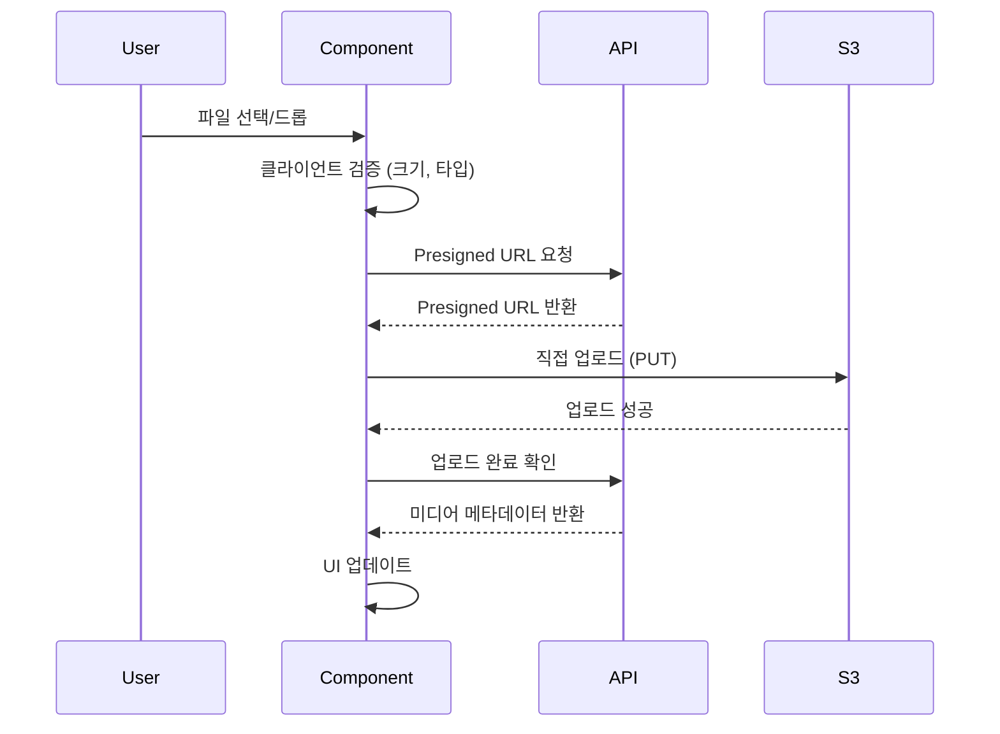

# F1. 하이엔드 자산 등록 폼 상세 설계서

**프로젝트명**: Hyper-Connect (MVP)
**작성일**: 2026-01-18
**버전**: 1.0
**우선순위**: P0 (최우선)

---

## 1. 개요

### 1.1 목적
F1 기능의 핵심인 차량 등록 다단계 폼의 상세 명세를 정의합니다.

### 1.2 설계 원칙
1. **사용자 친화**: 단계별로 분할하여 인지 부하 감소
2. **데이터 품질**: 필수 필드 강제 및 검증
3. **진행 상황 표시**: 실시간 진행률 피드백
4. **임시 저장**: 작업 중단 시 데이터 보존

---

## 2. 폼 전체 구조

### 2.1 6단계 프로세스


### 2.2 진행률 표시

**UI 예시**:
```
[●●●○○○] Step 3/6 - 정비 이력  50%
```

**구현**:
```tsx
<ProgressBar
  currentStep={3}
  totalSteps={6}
  percentage={50}
/>
```

---

## 3. Step 1: 기본 정보

### 3.1 필드 목록

| 필드명 | 타입 | 필수 | 설명 | 검증 규칙 |
|--------|------|------|------|-----------|
| `manufacturer` | Select | ✅ | 제조사 | 선택 필수 |
| `model` | Input | ✅ | 모델명 | 1-100자 |
| `year` | Year Picker | ✅ | 연식 | 1950 ~ 현재 년도 |
| `mileageKm` | Number | ✅ | 주행거리 (km) | 0 이상, 콤마 자동 삽입 |
| `vin` | Input | ✅ | VIN (차대번호) | 정확히 17자, 영숫자 |
| `registrationNumber` | Input | ❌ | 차량등록번호 | 선택, 한글+숫자 패턴 |
| `matchingNumbers` | Radio | ✅ | 매칭넘버 여부 | Yes/No |
| `priceKrw` | Number | ✅ | 희망 판매가 (원) | 1,000,000 이상 |

### 3.2 UI 레이아웃

```
┌─────────────────────────────────────────┐
│ Step 1: 기본 정보                        │
├─────────────────────────────────────────┤
│ 제조사 *                                 │
│ [Ferrari ▼]                             │
│                                          │
│ 모델명 *                                 │
│ [488 Pista_____________]                │
│                                          │
│ 연식 *          주행거리 (km) *          │
│ [2019 ▼]       [12,340__________]       │
│                                          │
│ VIN (차대번호) *                         │
│ [ZFF79ALA0K0123456_____________]        │
│                                          │
│ 차량등록번호 (선택)                       │
│ [12가3456_______________]                │
│                                          │
│ 매칭넘버 여부 *                          │
│ ◉ Yes  ○ No                             │
│                                          │
│ 희망 판매가 (원) *                       │
│ [580,000,000__________]                 │
│                                          │
│ [임시 저장]            [다음 →]          │
└─────────────────────────────────────────┘
```

### 3.3 제조사 옵션 (초기 데이터)

```tsx
const manufacturers = [
  'Ferrari',
  'Lamborghini',
  'Porsche',
  'McLaren',
  'Bugatti',
  'Aston Martin',
  'Bentley',
  'Rolls-Royce',
  'Mercedes-AMG',
  'BMW M',
  '기타',
];
```

### 3.4 검증 스키마 (Zod)

```tsx
const step1Schema = z.object({
  manufacturer: z.string().min(1, '제조사를 선택하세요'),
  model: z.string().min(1, '모델명을 입력하세요').max(100),
  year: z.number()
    .min(1950, '1950년 이후 차량만 등록 가능합니다')
    .max(new Date().getFullYear(), '미래 연식은 입력할 수 없습니다'),
  mileageKm: z.number()
    .min(0, '주행거리는 0 이상이어야 합니다')
    .max(1000000, '주행거리가 너무 큽니다'),
  vin: z.string()
    .length(17, 'VIN은 정확히 17자리여야 합니다')
    .regex(/^[A-HJ-NPR-Z0-9]{17}$/, 'VIN 형식이 올바르지 않습니다'),
  registrationNumber: z.string().optional(),
  matchingNumbers: z.boolean(),
  priceKrw: z.number()
    .min(1000000, '최소 100만원 이상이어야 합니다')
    .positive('가격은 양수여야 합니다'),
});
```

### 3.5 에러 메시지 표시

```tsx
{errors.vin && (
  <p className="text-sm text-red-500 mt-1">
    {errors.vin.message}
  </p>
)}
```

---

## 4. Step 2: 옵션 선택

### 4.1 필드 목록

| 필드명 | 타입 | 필수 | 설명 | 검증 규칙 |
|--------|------|------|------|-----------|
| `optionIds` | Checkbox[] | ✅ | 옵션 ID 배열 | 최소 3개 이상 |
| `customOptions` | Textarea | ❌ | 기타 옵션 | 최대 500자 |

### 4.2 UI 레이아웃

```
┌─────────────────────────────────────────┐
│ Step 2: 옵션 선택 (최소 3개 이상) *      │
├─────────────────────────────────────────┤
│ 성능 (Performance)                       │
│ ☑ 카본 세라믹 브레이크                    │
│ ☑ 스포츠 배기 시스템                      │
│ ☐ 레이스 모드 서스펜션                    │
│                                          │
│ 외장 (Exterior)                          │
│ ☑ 카본 파이버 패키지                      │
│ ☐ 포지드 휠                               │
│ ☐ 특별 페인트 (Rosso Corsa)              │
│                                          │
│ 내장 (Interior)                          │
│ ☑ 카본 레이싱 시트                        │
│ ☐ 알칸타라 스티어링 휠                    │
│                                          │
│ 편의 (Convenience)                       │
│ ☑ 프론트 리프트 시스템                    │
│ ☐ 후방 카메라                             │
│                                          │
│ 기타 옵션 (선택)                          │
│ [텍스트 입력 영역__________________]     │
│                                          │
│ 선택된 옵션: 5개 / 최소 3개 필요          │
│                                          │
│ [← 이전]  [임시 저장]         [다음 →]   │
└─────────────────────────────────────────┘
```

### 4.3 옵션 데이터 구조

```tsx
interface Option {
  id: string;
  category: 'performance' | 'exterior' | 'interior' | 'convenience';
  nameKo: string;
  nameEn: string;
}

// 예시 데이터
const ferrariOptions: Option[] = [
  {
    id: 'opt-001',
    category: 'performance',
    nameKo: '카본 세라믹 브레이크',
    nameEn: 'Carbon Ceramic Brakes',
  },
  // ...
];
```

### 4.4 검증 스키마

```tsx
const step2Schema = z.object({
  optionIds: z.array(z.string())
    .min(3, '최소 3개 이상의 옵션을 선택하세요'),
  customOptions: z.string()
    .max(500, '기타 옵션은 500자 이내로 입력하세요')
    .optional(),
});
```

### 4.5 동적 옵션 로딩

```tsx
// Step 1에서 선택한 제조사에 따라 옵션 목록 변경
const { data: options } = useOptions({
  manufacturer: formData.manufacturer,
});
```

---

## 5. Step 3: 정비 이력

### 5.1 필드 목록 (반복 가능)

| 필드명 | 타입 | 필수 | 설명 | 검증 규칙 |
|--------|------|------|------|-----------|
| `serviceDate` | Date | ✅ | 정비 일자 | 과거 날짜만 |
| `serviceCenter` | Input | ✅ | 정비소 이름 | 1-200자 |
| `description` | Textarea | ✅ | 정비 내용 | 1-1000자 |
| `documentUrl` | File Upload | ❌ | 문서 (PDF/이미지) | 최대 10MB |

### 5.2 UI 레이아웃

```
┌─────────────────────────────────────────┐
│ Step 3: 정비 이력                        │
├─────────────────────────────────────────┤
│ [+ 정비 이력 추가]                       │
│                                          │
│ ┌─────────────────────────────────────┐ │
│ │ 정비 이력 #1              [삭제 ×]   │ │
│ ├─────────────────────────────────────┤ │
│ │ 정비 일자 *                          │ │
│ │ [2025-12-15 📅]                     │ │
│ │                                      │ │
│ │ 정비소 이름 *                        │ │
│ │ [서울페라리_______________]          │ │
│ │                                      │ │
│ │ 정비 내용 *                          │ │
│ │ [정기 점검 및 엔진오일 교체          │ │
│ │  ______________________________]    │ │
│ │                                      │ │
│ │ 문서 첨부 (선택)                     │ │
│ │ [파일 선택] 또는 드래그 앤 드롭       │ │
│ │ invoice.pdf (2.3 MB) [삭제]         │ │
│ └─────────────────────────────────────┘ │
│                                          │
│ ┌─────────────────────────────────────┐ │
│ │ 정비 이력 #2              [삭제 ×]   │ │
│ └─────────────────────────────────────┘ │
│                                          │
│ [← 이전]  [임시 저장]         [다음 →]   │
└─────────────────────────────────────────┘
```

### 5.3 검증 스키마

```tsx
const maintenanceRecordSchema = z.object({
  serviceDate: z.date()
    .max(new Date(), '미래 날짜는 선택할 수 없습니다'),
  serviceCenter: z.string()
    .min(1, '정비소 이름을 입력하세요')
    .max(200),
  description: z.string()
    .min(1, '정비 내용을 입력하세요')
    .max(1000),
  documentUrl: z.string().url().optional(),
});

const step3Schema = z.object({
  maintenanceRecords: z.array(maintenanceRecordSchema)
    .optional(), // 정비 이력이 없을 수도 있음
});
```

### 5.4 동적 추가/삭제

```tsx
const [records, setRecords] = useState<MaintenanceRecord[]>([]);

const addRecord = () => {
  setRecords([...records, { id: generateId(), ...emptyRecord }]);
};

const removeRecord = (id: string) => {
  setRecords(records.filter(r => r.id !== id));
};
```

---

## 6. Step 4: 소모품 상태

### 6.1 필드 목록

**타이어**:
| 필드명 | 타입 | 필수 | 설명 | 검증 규칙 |
|--------|------|------|------|-----------|
| `tirePercentage` | Slider | ❌ | 잔량 (%) | 0-100 |
| `tireReplacementDate` | Date | ❌ | 교체 일자 | 과거 날짜 |
| `tireBrand` | Input | ❌ | 브랜드/모델 | 최대 100자 |

**브레이크**:
| 필드명 | 타입 | 필수 | 설명 | 검증 규칙 |
|--------|------|------|------|-----------|
| `brakePadThicknessMm` | Number | ❌ | 패드 두께 (mm) | 0-20 |
| `brakeDiskStatus` | Select | ❌ | 디스크 상태 | GOOD/FAIR/NEEDS_REPLACEMENT/REPLACED |

**엔진오일**:
| 필드명 | 타입 | 필수 | 설명 | 검증 규칙 |
|--------|------|------|------|-----------|
| `engineOilReplacementDate` | Date | ❌ | 교체 일자 | 과거 날짜 |
| `engineOilMileageKm` | Number | ❌ | 교체 후 주행거리 | 0 이상 |

### 6.2 UI 레이아웃

```
┌─────────────────────────────────────────┐
│ Step 4: 소모품 상태                      │
├─────────────────────────────────────────┤
│ 🛞 타이어                                │
│                                          │
│ 잔량 (%)                                 │
│ 0────────●──────100                      │
│         85%                              │
│                                          │
│ 교체 일자                                 │
│ [2025-06-10 📅]                         │
│                                          │
│ 브랜드/모델                               │
│ [Michelin Pilot Sport 4S_______]       │
│                                          │
├─────────────────────────────────────────┤
│ 🔧 브레이크                              │
│                                          │
│ 패드 두께 (mm)                           │
│ [8.5___]                                │
│                                          │
│ 디스크 상태                              │
│ [양호 (GOOD) ▼]                         │
│                                          │
├─────────────────────────────────────────┤
│ 🛢️ 엔진오일                              │
│                                          │
│ 최근 교체 일자                            │
│ [2025-12-15 📅]                         │
│                                          │
│ 교체 후 주행거리 (km)                     │
│ [500_______]                            │
│                                          │
│ [← 이전]  [임시 저장]         [다음 →]   │
└─────────────────────────────────────────┘
```

### 6.3 검증 스키마

```tsx
const step4Schema = z.object({
  consumableStatus: z.object({
    tirePercentage: z.number().min(0).max(100).optional(),
    tireReplacementDate: z.date().optional(),
    tireBrand: z.string().max(100).optional(),
    brakePadThicknessMm: z.number().min(0).max(20).optional(),
    brakeDiskStatus: z.enum(['GOOD', 'FAIR', 'NEEDS_REPLACEMENT', 'REPLACED']).optional(),
    engineOilReplacementDate: z.date().optional(),
    engineOilMileageKm: z.number().min(0).optional(),
  }).optional(),
});
```

---

## 7. Step 5: 미디어 업로드

### 7.1 필드 목록

| 필드명 | 타입 | 필수 | 설명 | 검증 규칙 |
|--------|------|------|------|-----------|
| `images` | File[] | ✅ | 이미지 파일 | 최소 20장, 각 최대 10MB |
| `videos` | File[] | ❌ | 영상 파일 (P1) | 최대 500MB |
| `audios` | File[] | ❌ | 엔진 사운드 | 최대 20MB |

### 7.2 UI 레이아웃

```
┌─────────────────────────────────────────┐
│ Step 5: 미디어 업로드                    │
├─────────────────────────────────────────┤
│ 📸 이미지 (최소 20장 필수) *             │
│                                          │
│ ┌─────────────────────────────────────┐ │
│ │ 🖼️ 드래그 앤 드롭하여 이미지 업로드   │ │
│ │    또는 클릭하여 파일 선택             │ │
│ │                                      │ │
│ │    JPG, PNG, WebP (각 최대 10MB)    │ │
│ └─────────────────────────────────────┘ │
│                                          │
│ 업로드된 이미지: 5 / 최소 20장 필요       │
│                                          │
│ ┌────────────────────────────────────┐  │
│ │ [img1] [img2] [img3] [img4] [img5] │  │
│ │  🗑️     🗑️     🗑️     🗑️     🗑️   │  │
│ └────────────────────────────────────┘  │
│                                          │
│ 💡 Tip: 드래그하여 순서 변경 가능         │
│                                          │
│ 업로드 진행률                             │
│ ████████░░░░░░░░░░░░ 40% (2/5)          │
│                                          │
│ [← 이전]  [임시 저장]         [다음 →]   │
└─────────────────────────────────────────┘
```

### 7.3 검증 스키마

```tsx
const step5Schema = z.object({
  images: z.array(z.instanceof(File))
    .min(20, '최소 20장의 이미지를 업로드하세요')
    .refine(
      files => files.every(f => f.size <= 10 * 1024 * 1024),
      '각 이미지는 10MB 이하여야 합니다'
    )
    .refine(
      files => files.every(f => ['image/jpeg', 'image/png', 'image/webp'].includes(f.type)),
      '이미지 형식은 JPG, PNG, WebP만 허용됩니다'
    ),
  videos: z.array(z.instanceof(File)).optional(),
  audios: z.array(z.instanceof(File)).optional(),
});
```

### 7.4 업로드 플로우



### 7.5 드래그 앤 드롭 순서 변경

```tsx
import { DndContext, closestCenter } from '@dnd-kit/core';
import { SortableContext, arrayMove } from '@dnd-kit/sortable';

function handleDragEnd(event) {
  const { active, over } = event;
  if (active.id !== over.id) {
    setImages((items) => {
      const oldIndex = items.findIndex(i => i.id === active.id);
      const newIndex = items.findIndex(i => i.id === over.id);
      return arrayMove(items, oldIndex, newIndex);
    });
  }
}
```

---

## 8. Step 6: 최종 확인

### 8.1 UI 레이아웃

```
┌─────────────────────────────────────────┐
│ Step 6: 최종 확인                        │
├─────────────────────────────────────────┤
│ 📋 기본 정보               [수정]        │
│ • 제조사: Ferrari                        │
│ • 모델: 488 Pista                        │
│ • 연식: 2019년                           │
│ • 주행거리: 12,340 km                    │
│ • VIN: ZFF79ALA0K0123456                │
│ • 매칭넘버: Yes                          │
│ • 희망 판매가: 580,000,000원             │
│                                          │
│ ⚙️ 옵션 (5개)               [수정]       │
│ • 카본 세라믹 브레이크                    │
│ • 스포츠 배기 시스템                      │
│ • 카본 파이버 패키지                      │
│ • 카본 레이싱 시트                        │
│ • 프론트 리프트 시스템                    │
│                                          │
│ 🔧 정비 이력 (2건)          [수정]       │
│ • 2025-12-15: 정기 점검 (서울페라리)     │
│ • 2025-06-10: 타이어 교체                │
│                                          │
│ 🛠️ 소모품 상태              [수정]       │
│ • 타이어: 85% (2025-06-10 교체)         │
│ • 브레이크 패드: 8.5mm (양호)            │
│ • 엔진오일: 2025-12-15 교체 (500km)     │
│                                          │
│ 📸 미디어                   [수정]        │
│ • 이미지: 25장                           │
│ • 영상: 0건                              │
│                                          │
│ ⚠️ 제출 전 확인 사항                     │
│ ☑ 모든 정보가 정확함을 확인했습니다       │
│ ☑ 이용약관 및 개인정보처리방침에 동의      │
│                                          │
│ [← 이전]                [제출 →]         │
└─────────────────────────────────────────┘
```

### 8.2 최종 검증

```tsx
const step6Schema = z.object({
  confirmAccurate: z.boolean()
    .refine(val => val === true, '정보 확인이 필요합니다'),
  agreeToTerms: z.boolean()
    .refine(val => val === true, '이용약관 동의가 필요합니다'),
});
```

### 8.3 제출 플로우

```tsx
const handleSubmit = async () => {
  try {
    // 1. 모든 Step 검증
    const isValid = await validateAllSteps();
    if (!isValid) {
      alert('필수 항목을 확인하세요');
      return;
    }

    // 2. API 호출
    const vehicle = await createVehicle(formData);

    // 3. 성공 메시지 및 리다이렉트
    toast.success('차량 등록이 완료되었습니다. 관리자 승인 후 공개됩니다.');
    router.push(`/dashboard`);
  } catch (error) {
    toast.error('등록 중 오류가 발생했습니다.');
  }
};
```

---

## 9. 임시 저장 (Draft)

### 9.1 저장 시점
- 각 Step 이동 시 자동 저장
- "임시 저장" 버튼 클릭 시
- 5분마다 자동 저장 (백그라운드)

### 9.2 저장 위치
- **LocalStorage** (클라이언트): 네트워크 실패 대비
- **Backend API** (서버): 디바이스 간 동기화

### 9.3 구현

```tsx
// Auto-save every 5 minutes
useEffect(() => {
  const interval = setInterval(() => {
    saveDraft(formData);
  }, 5 * 60 * 1000);

  return () => clearInterval(interval);
}, [formData]);

// Save on step change
const handleNextStep = () => {
  saveDraft(formData);
  setCurrentStep(prev => prev + 1);
};
```

---

## 10. 에러 핸들링

### 10.1 필드별 에러

```tsx
{errors.manufacturer && (
  <span className="text-sm text-red-500">
    {errors.manufacturer.message}
  </span>
)}
```

### 10.2 전역 에러

```tsx
{globalError && (
  <Alert variant="destructive">
    <AlertTitle>오류</AlertTitle>
    <AlertDescription>{globalError}</AlertDescription>
  </Alert>
)}
```

### 10.3 네트워크 에러

```tsx
try {
  await uploadImage(file);
} catch (error) {
  if (error.code === 'NETWORK_ERROR') {
    toast.error('네트워크 연결을 확인하세요');
  } else {
    toast.error('업로드 중 오류가 발생했습니다');
  }
}
```

---

## 11. 접근성 (a11y)

### 11.1 키보드 네비게이션
- Tab: 다음 필드
- Shift + Tab: 이전 필드
- Enter: 폼 제출 (마지막 Step)

### 11.2 스크린 리더
```tsx
<label htmlFor="manufacturer">
  제조사 <span className="text-red-500" aria-label="필수">*</span>
</label>
<select
  id="manufacturer"
  aria-required="true"
  aria-invalid={!!errors.manufacturer}
  aria-describedby={errors.manufacturer ? 'manufacturer-error' : undefined}
>
  {/* options */}
</select>
{errors.manufacturer && (
  <p id="manufacturer-error" role="alert">
    {errors.manufacturer.message}
  </p>
)}
```

---

## 12. 성능 최적화

### 12.1 대용량 이미지 업로드
- 병렬 업로드 (최대 3개 동시)
- 업로드 실패 시 재시도
- 진행률 표시

```tsx
const uploadImages = async (files: File[]) => {
  const chunks = chunkArray(files, 3); // 3개씩 묶음

  for (const chunk of chunks) {
    await Promise.all(chunk.map(uploadSingleImage));
  }
};
```

### 12.2 폼 상태 최적화
- React Hook Form의 `mode: 'onBlur'` 사용 (onChange보다 성능 good)
- 불필요한 리렌더링 방지

---

## 13. 다음 단계

이 F1 폼 설계를 기반으로 다음 문서를 작성합니다:
- ✅ **미디어 처리 설계서** (다음 작업)
- S3 업로드, 이미지 리사이징 상세 명세

---

## 변경 이력

| 버전 | 날짜 | 변경 내용 | 작성자 |
|------|------|----------|--------|
| 1.0 | 2026-01-18 | 초안 작성 (6단계 폼 상세 설계) | Claude |
