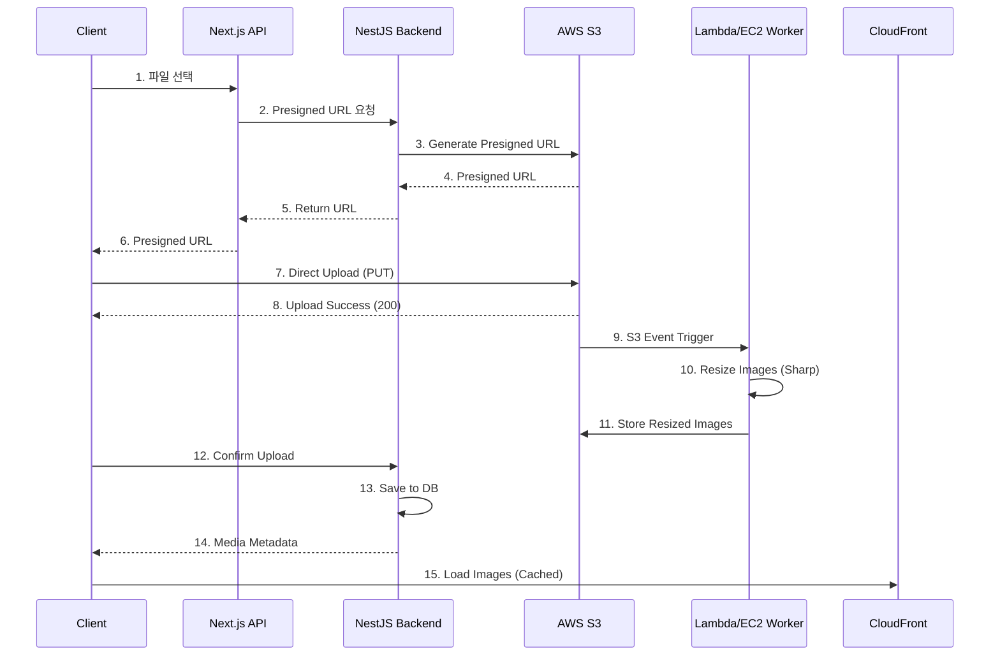

# Hyper-Connect MVP 미디어 처리 설계서

**프로젝트명**: Hyper-Connect (MVP)
**작성일**: 2026-01-18
**버전**: 1.0
**Storage**: AWS S3 + CloudFront CDN

---

## 1. 개요

### 1.1 목적
고급 차량의 시각적 가치를 전달하기 위한 고품질 미디어 처리 시스템을 설계합니다.

### 1.2 미디어 유형

| 유형 | MVP 단계 | 용도 | 최대 크기 |
|------|---------|------|----------|
| **이미지** | P0 | 차량 사진 | 10MB/장 |
| **영상 (4K)** | P1 | 차량 시승 영상 | 500MB |
| **오디오** | P2 | 엔진 사운드 | 20MB |
| **PDF** | P0 | 정비 이력 문서 | 10MB |

---

## 2. S3 버킷 구조

### 2.1 디렉토리 계층

```
hyper-connect-media/
├── vehicles/
│   └── {vehicleId}/                 # 차량별 폴더
│       ├── images/
│       │   ├── original/            # 원본 (보관용)
│       │   ├── large/               # 1920x1080 (상세 페이지)
│       │   ├── medium/              # 1024x768 (목록 페이지)
│       │   ├── thumb/               # 320x240 (썸네일)
│       │   └── webp/                # WebP 포맷 (최적화)
│       ├── videos/                  # P1
│       │   ├── raw/                 # 원본 4K
│       │   └── hls/                 # HLS 스트림
│       └── documents/               # 정비 이력 PDF
│           └── maintenance/
└── temp/                            # 임시 업로드 (24시간 자동 삭제)
    └── {userId}/
        └── {uploadId}/
```

### 2.2 파일 명명 규칙

**패턴**: `{timestamp}-{uuid}.{ext}`

**예시**:
- 원본: `20260118-a1b2c3d4-e5f6.jpg`
- Large: `20260118-a1b2c3d4-e5f6-large.jpg`
- Thumb: `20260118-a1b2c3d4-e5f6-thumb.jpg`
- WebP: `20260118-a1b2c3d4-e5f6-large.webp`

---

## 3. 이미지 업로드 플로우

### 3.1 전체 프로세스



---

### 3.2 Step-by-Step 설명

#### Step 1-6: Presigned URL 요청

**클라이언트** (`components/forms/MediaUploader.tsx`):
```tsx
const requestPresignedUrl = async (file: File) => {
  const response = await fetch('/api/media/presigned-url', {
    method: 'POST',
    headers: { 'Content-Type': 'application/json' },
    body: JSON.stringify({
      vehicleId: vehicleId,
      fileName: file.name,
      fileSize: file.size,
      mimeType: file.type,
    }),
  });

  const { uploadUrl, s3Key } = await response.json();
  return { uploadUrl, s3Key };
};
```

**Backend** (`src/modules/media/media.service.ts`):
```typescript
async generatePresignedUrl(dto: PresignedUrlDto) {
  const s3Key = `vehicles/${dto.vehicleId}/images/original/${generateFileName(dto.fileName)}`;

  const command = new PutObjectCommand({
    Bucket: 'hyper-connect-media',
    Key: s3Key,
    ContentType: dto.mimeType,
    Metadata: {
      vehicleId: dto.vehicleId,
      userId: dto.userId,
    },
  });

  const url = await getSignedUrl(this.s3Client, command, {
    expiresIn: 900, // 15분
  });

  return { uploadUrl: url, s3Key };
}
```

---

#### Step 7-8: S3 직접 업로드

**클라이언트**:
```tsx
const uploadToS3 = async (file: File, uploadUrl: string) => {
  const response = await fetch(uploadUrl, {
    method: 'PUT',
    headers: {
      'Content-Type': file.type,
    },
    body: file,
  });

  if (!response.ok) {
    throw new Error('Upload failed');
  }

  return response;
};
```

**진행률 표시**:
```tsx
const uploadWithProgress = async (file: File, uploadUrl: string) => {
  const xhr = new XMLHttpRequest();

  xhr.upload.addEventListener('progress', (e) => {
    if (e.lengthComputable) {
      const percentComplete = (e.loaded / e.total) * 100;
      setUploadProgress(percentComplete);
    }
  });

  return new Promise((resolve, reject) => {
    xhr.addEventListener('load', () => {
      if (xhr.status === 200) {
        resolve(xhr.response);
      } else {
        reject(new Error('Upload failed'));
      }
    });

    xhr.open('PUT', uploadUrl);
    xhr.setRequestHeader('Content-Type', file.type);
    xhr.send(file);
  });
};
```

---

#### Step 9-11: 이미지 리사이징 (Lambda 함수)

**Lambda 함수** (`lambda/image-processor/index.js`):
```javascript
const AWS = require('aws-sdk');
const sharp = require('sharp');

const s3 = new AWS.S3();

const sizes = [
  { name: 'large', width: 1920, height: 1080 },
  { name: 'medium', width: 1024, height: 768 },
  { name: 'thumb', width: 320, height: 240 },
];

exports.handler = async (event) => {
  for (const record of event.Records) {
    const bucket = record.s3.bucket.name;
    const key = record.s3.object.key; // vehicles/{id}/images/original/xxx.jpg

    // 원본 이미지 다운로드
    const original = await s3.getObject({ Bucket: bucket, Key: key }).promise();

    for (const size of sizes) {
      // Sharp로 리사이징
      const resized = await sharp(original.Body)
        .resize(size.width, size.height, {
          fit: 'cover',
          withoutEnlargement: true,
        })
        .jpeg({ quality: 85, progressive: true })
        .toBuffer();

      // 리사이징된 이미지 저장
      const newKey = key.replace('/original/', `/${size.name}/`);
      await s3.putObject({
        Bucket: bucket,
        Key: newKey,
        Body: resized,
        ContentType: 'image/jpeg',
        CacheControl: 'max-age=31536000', // 1년
      }).promise();

      // WebP 포맷도 생성
      const webp = await sharp(original.Body)
        .resize(size.width, size.height, { fit: 'cover' })
        .webp({ quality: 80 })
        .toBuffer();

      const webpKey = newKey.replace('.jpg', '.webp').replace(`/${size.name}/`, '/webp/');
      await s3.putObject({
        Bucket: bucket,
        Key: webpKey,
        Body: webp,
        ContentType: 'image/webp',
        CacheControl: 'max-age=31536000',
      }).promise();
    }
  }

  return { statusCode: 200 };
};
```

**S3 이벤트 트리거 설정**:
```json
{
  "Events": ["s3:ObjectCreated:*"],
  "Filter": {
    "Key": {
      "FilterRules": [
        {
          "Name": "prefix",
          "Value": "vehicles/"
        },
        {
          "Name": "suffix",
          "Value": "/original/"
        }
      ]
    }
  }
}
```

---

#### Step 12-14: 업로드 완료 확인

**클라이언트**:
```tsx
const confirmUpload = async (s3Key: string) => {
  const response = await fetch('/api/media/confirm-upload', {
    method: 'POST',
    headers: { 'Content-Type': 'application/json' },
    body: JSON.stringify({
      vehicleId,
      s3Key,
      fileType: 'IMAGE',
      originalFilename: file.name,
      width: imageWidth,
      height: imageHeight,
    }),
  });

  const { data } = await response.json();
  return data; // { id, cdnUrl, ... }
};
```

**Backend**:
```typescript
async confirmUpload(dto: ConfirmUploadDto) {
  const cdnUrl = `https://cdn.hyper-connect.com/${dto.s3Key}`;

  const mediaFile = await this.prisma.mediaFile.create({
    data: {
      vehicleId: dto.vehicleId,
      fileType: dto.fileType,
      originalFilename: dto.originalFilename,
      s3Key: dto.s3Key,
      cdnUrl,
      fileSizeBytes: dto.fileSize,
      width: dto.width,
      height: dto.height,
      displayOrder: await this.getNextDisplayOrder(dto.vehicleId),
    },
  });

  return mediaFile;
}
```

---

## 4. CDN 설정 (CloudFront)

### 4.1 Distribution 설정

**Origin**:
- Origin Domain: `hyper-connect-media.s3.amazonaws.com`
- Origin Path: `/`
- Origin Shield: 활성화 (Seoul)

**Behaviors**:
| Path Pattern | Viewer Protocol | Cache Policy | Compress |
|-------------|----------------|--------------|----------|
| `/vehicles/*` | Redirect HTTP to HTTPS | CachingOptimized | Yes |
| `/temp/*` | Redirect HTTP to HTTPS | CachingDisabled | No |

**Cache Policy**:
```json
{
  "MinTTL": 0,
  "DefaultTTL": 86400,
  "MaxTTL": 31536000,
  "ParametersInCacheKeyAndForwardedToOrigin": {
    "QueryStringsConfig": {
      "QueryStringBehavior": "none"
    },
    "HeadersConfig": {
      "HeaderBehavior": "whitelist",
      "Headers": {
        "Items": ["Accept", "Accept-Encoding"]
      }
    }
  }
}
```

---

### 4.2 반응형 이미지 제공

**Next.js Image 컴포넌트**:
```tsx
import Image from 'next/image';

<Image
  src={`https://cdn.hyper-connect.com/vehicles/${vehicleId}/images/large/${imageId}.webp`}
  alt={vehicle.model}
  width={1920}
  height={1080}
  loading="lazy"
  placeholder="blur"
  blurDataURL={thumbUrl}
  srcSet={`
    ${mediumUrl} 1024w,
    ${largeUrl} 1920w
  `}
  sizes="(max-width: 768px) 100vw, (max-width: 1200px) 50vw, 33vw"
/>
```

**Picture 태그 (WebP fallback)**:
```tsx
<picture>
  <source
    type="image/webp"
    srcSet={`
      ${thumbWebP} 320w,
      ${mediumWebP} 1024w,
      ${largeWebP} 1920w
    `}
  />
  <source
    type="image/jpeg"
    srcSet={`
      ${thumbJPEG} 320w,
      ${mediumJPEG} 1024w,
      ${largeJPEG} 1920w
    `}
  />
  
</picture>
```

---

## 5. 이미지 최적화 전략

### 5.1 자동 최적화 파이프라인

| 단계 | 작업 | 도구 |
|------|------|------|
| 1. 업로드 | 원본 저장 | S3 |
| 2. 리사이징 | 3가지 크기 생성 | Sharp (Lambda) |
| 3. 포맷 변환 | WebP 생성 | Sharp |
| 4. 메타데이터 제거 | EXIF 제거 | Sharp |
| 5. 압축 | JPEG 85%, WebP 80% | Sharp |
| 6. CDN 배포 | 엣지 캐싱 | CloudFront |

### 5.2 Sharp 설정

```javascript
const optimizeImage = async (buffer) => {
  return sharp(buffer)
    .resize(1920, 1080, {
      fit: 'cover',
      withoutEnlargement: true,
    })
    .jpeg({
      quality: 85,
      progressive: true,
      chromaSubsampling: '4:4:4',
    })
    .removeAlpha() // 투명도 제거 (JPEG)
    .rotate() // EXIF 기반 자동 회전
    .toBuffer();
};
```

---

## 6. 영상 처리 (P1 - 4K 스트리밍)

### 6.1 HLS (HTTP Live Streaming)

**인코딩 파이프라인**:
```
원본 4K (MP4) → AWS MediaConvert → HLS 세그먼트
                                   ├─ 4K (3840x2160)
                                   ├─ 1080p (1920x1080)
                                   ├─ 720p (1280x720)
                                   └─ 480p (854x480)
```

**MediaConvert 설정**:
```json
{
  "OutputGroups": [
    {
      "Name": "HLS",
      "Outputs": [
        {
          "VideoDescription": {
            "Width": 3840,
            "Height": 2160,
            "CodecSettings": {
              "Codec": "H_265",
              "H265Settings": {
                "Bitrate": 20000000
              }
            }
          }
        },
        {
          "VideoDescription": {
            "Width": 1920,
            "Height": 1080,
            "CodecSettings": {
              "Codec": "H_264",
              "H264Settings": {
                "Bitrate": 5000000
              }
            }
          }
        }
      ]
    }
  ]
}
```

---

### 6.2 Video.js 플레이어

```tsx
import videojs from 'video.js';

const VideoPlayer = ({ vehicleId, videoId }) => {
  const videoRef = useRef(null);

  useEffect(() => {
    const player = videojs(videoRef.current, {
      controls: true,
      autoplay: false,
      preload: 'metadata',
      fluid: true,
      sources: [{
        src: `https://cdn.hyper-connect.com/vehicles/${vehicleId}/videos/hls/${videoId}/master.m3u8`,
        type: 'application/x-mpegURL',
      }],
    });

    return () => {
      player.dispose();
    };
  }, []);

  return (
    <video
      ref={videoRef}
      className="video-js vjs-big-play-centered"
    />
  );
};
```

---

## 7. 파일 크기 제한 및 검증

### 7.1 클라이언트 검증

```tsx
const validateFile = (file: File) => {
  const maxSize = 10 * 1024 * 1024; // 10MB
  const allowedTypes = ['image/jpeg', 'image/png', 'image/webp'];

  if (file.size > maxSize) {
    throw new Error('파일 크기는 10MB 이하여야 합니다');
  }

  if (!allowedTypes.includes(file.type)) {
    throw new Error('JPG, PNG, WebP 형식만 허용됩니다');
  }

  return true;
};
```

### 7.2 서버 검증

```typescript
// NestJS DTO
export class PresignedUrlDto {
  @IsUUID()
  vehicleId: string;

  @IsString()
  @MaxLength(255)
  fileName: string;

  @IsNumber()
  @Max(10 * 1024 * 1024) // 10MB
  fileSize: number;

  @IsIn(['image/jpeg', 'image/png', 'image/webp'])
  mimeType: string;
}
```

---

## 8. 비용 최적화

### 8.1 S3 Lifecycle Policy

```json
{
  "Rules": [
    {
      "Id": "DeleteTempUploads",
      "Status": "Enabled",
      "Prefix": "temp/",
      "Expiration": {
        "Days": 1
      }
    },
    {
      "Id": "TransitionOldOriginals",
      "Status": "Enabled",
      "Prefix": "vehicles/",
      "Filter": {
        "And": {
          "Tags": [{ "Key": "type", "Value": "original" }]
        }
      },
      "Transitions": [
        {
          "Days": 90,
          "StorageClass": "GLACIER_IR"
        }
      ]
    }
  ]
}
```

### 8.2 CloudFront 비용

**예상 비용** (월 1TB 전송):
- S3 스토리지 (100GB): $2.30
- CloudFront (1TB 전송): $85
- Lambda 실행 (10만 건): $2
- **총**: ~$90/월

**최적화 전략**:
- 한국/미국/중동 주요 엣지만 활성화
- Cache Hit Ratio 95% 이상 유지
- Intelligent-Tiering 사용

---

## 9. 보안

### 9.1 Presigned URL 보안

- 유효기간: 15분
- 1회 사용 후 만료 (nonce 사용)
- 사용자 인증 확인

```typescript
const url = await getSignedUrl(s3Client, command, {
  expiresIn: 900,
  unhoistableHeaders: new Set(['x-amz-server-side-encryption']),
});
```

### 9.2 S3 버킷 정책

```json
{
  "Version": "2012-10-17",
  "Statement": [
    {
      "Sid": "DenyInsecureTransport",
      "Effect": "Deny",
      "Principal": "*",
      "Action": "s3:*",
      "Resource": "arn:aws:s3:::hyper-connect-media/*",
      "Condition": {
        "Bool": {
          "aws:SecureTransport": "false"
        }
      }
    }
  ]
}
```

---

## 10. 모니터링

### 10.1 CloudWatch 메트릭

| 메트릭 | 임계값 | 알림 |
|--------|--------|------|
| S3 4xx 에러율 | > 1% | Email |
| Lambda 실행 실패 | > 5% | Slack |
| CloudFront Cache Hit Ratio | < 90% | Dashboard |

### 10.2 로깅

**S3 Access Logs**: 활성화
**CloudFront Logs**: 활성화 (Standard)
**Lambda Logs**: CloudWatch Logs

---

## 11. 다음 단계

모든 설계 문서가 완성되었습니다. 다음은:
- ✅ **③ 검증 단계 (목업 제작)**: F1 등록 폼 UI 먼저 구현
- ⑤ 개발 단계: 실제 코드 작성

---

## 변경 이력

| 버전 | 날짜 | 변경 내용 | 작성자 |
|------|------|----------|--------|
| 1.0 | 2026-01-18 | 초안 작성 (S3 + CloudFront 기반) | Claude |
